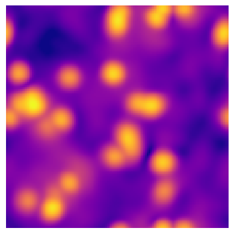

Philip Mocz

2018

Princeton University


# BELEROFON

High-performance Spectral Solver for the Gross-Pitaevskii Poisson equations

  * Built for shared-memory system, uses openMP
  * written in C
  * uses FFTW3, HDF5
  * ideal for 1024^3 runs


## How to compile

```
make clean; make
```


## How to run

to run on 4 threads ...
```
./belerofon 4
```


## Installing fftw3 

```
./configure CC=mpicc --enable-threads --enable-openmp
make
make install
```

## Simulation Description

Start with a random initial condition and watch for the phase transition and formation of solitons.

E.g. 64 x 64 x 64 initial condition:


Evolved State:




## Technical References

http://www.fftw.org/fftw3_doc/What-FFTW-Really-Computes.html#What-FFTW-Really-Computes
http://davis.lbl.gov/Manuals/HDF5-1.6.1/Intro/IntroExamples.html
http://www.mathcs.emory.edu/~cheung/Courses/355/Syllabus/91-pthreads/openMP4.html
https://www.openmp.org/wp-content/uploads/OpenMP4.0.0.Examples.pdf
https://www.cac.cornell.edu/education/training/StampedeOct2013/OpenMP.pdf
